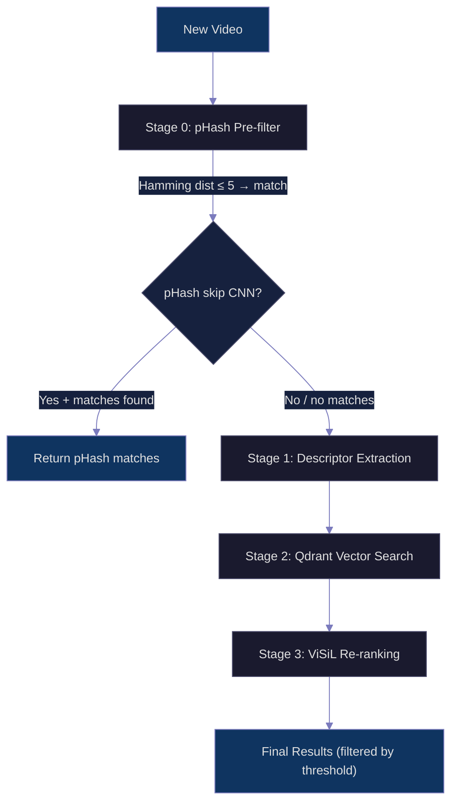
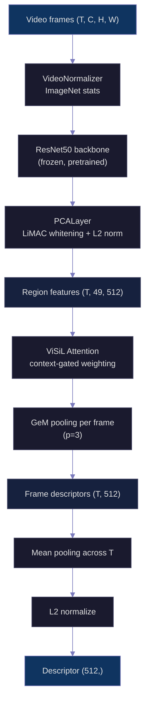
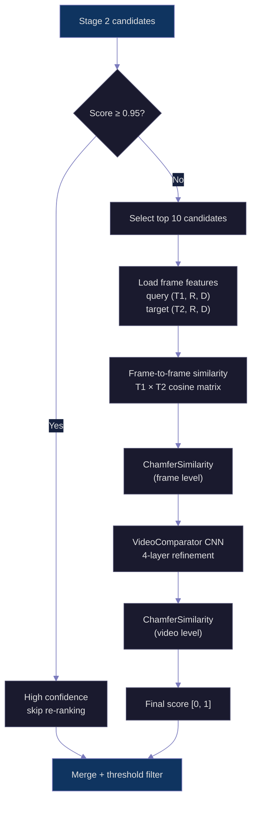
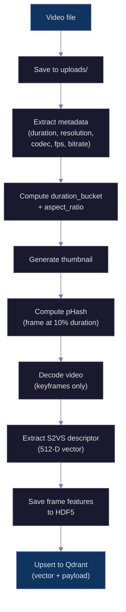
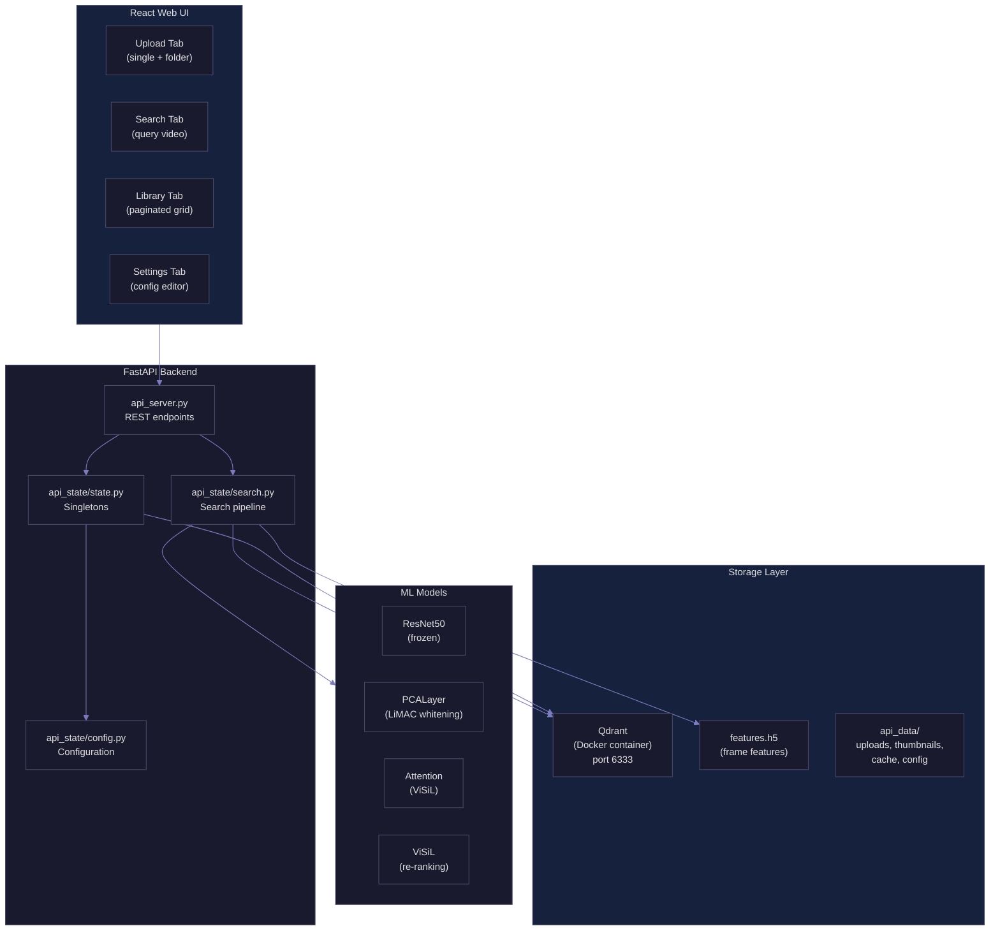

# Video Deduplication — Technical Architecture

## Problem

Given a database of 10,000+ videos and a new incoming video, find duplicates in sub-second time. The existing S2VS/ViSiL pipeline computes full frame-to-frame similarity matrices per pair (~3.7B FLOPs each), making brute-force search over 10K videos take hours.

## Solution: Four-Stage Pipeline



---

## Stage 0 — pHash Pre-filter

Perceptual hashing provides ultra-fast exact-copy detection before the expensive CNN pipeline.

**How it works:**

1. Extract a single representative frame at **10% of video duration** via FFmpeg
2. Compute a 64-bit perceptual hash using DCT-based `imagehash.phash()`
3. Compare against all stored hashes using **Hamming distance** (XOR + popcount)
4. Match threshold: **≤ 5 bits** out of 64 (score = `1.0 - distance/64`)

**Performance:**

| Distance | Score  | Meaning               |
|----------|--------|-----------------------|
| 0        | 1.000  | Identical frame       |
| 3        | 0.953  | Minor re-encode       |
| 5        | 0.922  | Threshold match       |
| 10       | 0.844  | Unlikely match        |
| 64       | 0.000  | Completely different  |

**Configuration:**
- `phash_skip_cnn: true` — if pHash matches are found, skip the entire CNN pipeline (Stages 1-3) and return immediately. Default: enabled.
- Stored in Qdrant payloads as hex string (e.g., `"a1b2c3d4e5f60718"`)
- Loaded into memory on server startup via `scroll_all_payloads(["video_id", "phash"])`

**Catches:** re-encodes, resolution changes, minor crops, watermarks
**Misses:** semantic duplicates, significant edits, different recordings of same event

---

## Stage 1 — Descriptor Extraction (S2VS Embedding)

Each video is reduced to a single **512-dimensional L2-normalized vector** using the pretrained S2VS feature extractor.



### Pipeline components

| Component | Details |
|-----------|---------|
| **VideoNormalizer** | Converts uint8 [0,255] → float32 [0,1], applies ImageNet stats (mean=[0.485, 0.456, 0.406], std=[0.229, 0.224, 0.225]) |
| **ResNet50** | Standard torchvision ResNet50 with ImageNet pretrained weights. Frozen during training — only similarity network is trained. Outputs spatial feature maps. |
| **PCALayer** | Pretrained LiMAC whitening from [visil/pca_resnet50_vcdb_1M.pth](http://ndd.iti.gr/visil/pca_resnet50_vcdb_1M.pth). Centers features, applies PCA projection `x @ DVt`, L2 normalizes. Reduces to 512 dims. |
| **Attention** | ViSiL's context-gated attention (`torch.tanh` activation). Learns per-region importance weights. From pretrained `s2vs_dns` checkpoint. |
| **GeM pooling** | Generalized Mean pooling with power p=3: `(avg(x^p))^(1/p)`. Applied spatially over 7×7 region grid → one descriptor per frame. |
| **Temporal pooling** | Simple mean across T frame descriptors → single video descriptor |
| **L2 normalize** | Unit-length vector for cosine similarity compatibility |

### Video decoding

- Uses **I-frame (keyframe) extraction** via FFmpeg for fast decoding
- `load_video_tensor(video_path, keyframes_only=True)` returns `(T, C, H, W)` tensor
- Processing is batched with configurable `batch_sz` (default 256 frames per batch)

### Descriptor caching

- Descriptors are cached by file content hash in `api_data/descriptor_cache/`
- Cache key: SHA-256 of file contents → `.npz` file
- Prevents recomputation on repeated searches with the same query video

### Alternative backend: CLIP (optional)

```
Frames → CLIP ViT-B/32 image encoder → (T, 512)
     → Mean pooling across time → (512,)
     → L2 normalize
```

Better robustness to color/brightness changes. Requires `pip install open-clip-torch`.

---

## Stage 2 — Qdrant Vector Search

The 512-D descriptor is searched against all indexed videos using Qdrant's vector similarity engine.

### Collection configuration

| Parameter | Value | Notes |
|-----------|-------|-------|
| Distance metric | `COSINE` | Equivalent to inner product on L2-normalized vectors |
| Vector dimension | 512 | Configurable via embedding backend |
| Binary quantization | Optional (default on) | `BinaryQuantization(always_ram=True)` |
| Quantization search params | `rescore=True, oversampling=1.5` | Re-scores with original vectors after BQ shortlist |

### Payload indexes

Four keyword indexes are created for fast filtering:

```
video_id         KEYWORD   (unique identifier)
duration_bucket  KEYWORD   (search filter)
aspect_ratio     KEYWORD   (search filter)
phash            KEYWORD   (hex-serialized pHash)
```

### Metadata filtering

Before vector search, the query video's metadata is extracted and used to narrow the candidate pool:

**Duration buckets:**

| Bucket | Range |
|--------|-------|
| `0-10s` | 0 – 10 seconds |
| `10-30s` | 10 – 30 seconds |
| `30-60s` | 30 – 60 seconds |
| `1-5m` | 1 – 5 minutes |
| `5-30m` | 5 – 30 minutes |
| `30m+` | > 30 minutes |
| `unknown` | Duration unavailable |

**Aspect ratios:**

| Class | Condition |
|-------|-----------|
| `landscape` | width/height > 1.2 |
| `square` | 0.8 ≤ width/height ≤ 1.2 |
| `portrait` | width/height < 0.8 |
| `unknown` | Dimensions unavailable |

These are applied as Qdrant `Filter(must=[...])` conditions (AND logic), so a landscape 30-second video only searches against other landscape videos in the 30-60s bucket.

### Pre-threshold cutoff

Candidates from vector search are filtered by `pre_threshold = threshold × 0.5` before proceeding to Stage 3. With default threshold=0.5, this means candidates below 0.25 cosine similarity are immediately discarded.

### Segments and indexing

Qdrant automatically manages internal segments (subdivisions within a collection). Key behaviors:

| Concept | Details |
|---------|---------|
| **Segments** | Internal data partitions, auto-managed. Typically 2+ segments. |
| **HNSW index** | Built automatically when vector count exceeds `indexing_threshold` (default: 20,000). Below this, brute-force scan is used — fast enough at <20K scale. |
| **Indexed vectors** | Shows `0` until threshold is reached. This is normal — not an error. |
| **Sharding** | Distributes across nodes. Not needed at <100K scale (single-node is sufficient). |
| **Snapshots** | Server-side snapshots for backup/restore. Created via `create_snapshot()`. |

### Stored payload fields

Each indexed video stores:

```json
{
  "video_id": "beach_sunset_a1b2c3d4",
  "duration_bucket": "10-30s",
  "aspect_ratio": "landscape",
  "phash": "a1b2c3d4e5f60718",
  "path": "/uploads/beach_sunset_a1b2c3d4.mp4",
  "duration": 22.5,
  "width": 1920,
  "height": 1080,
  "codec": "h264",
  "fps": 29.97
}
```

---

## Stage 3 — ViSiL Re-ranking

The top candidates from Stage 2 are re-ranked using the full ViSiL frame-to-frame similarity pipeline for maximum accuracy.



### Re-ranking parameters

| Parameter | Value | Description |
|-----------|-------|-------------|
| `VISIL_SKIP_ABOVE` | 0.95 | Candidates above this score skip re-ranking (already high confidence) |
| `VISIL_MAX_CANDIDATES` | 10 | Maximum candidates sent through full ViSiL pipeline |

### ViSiL computation

For each candidate pair (query, target):

1. **Frame features**: Load pre-computed region features `(T, 49, 512)` from HDF5
2. **Index video**: Apply attention weighting to both query and target features
3. **Similarity matrix**: Compute normalized `(T1, T2)` similarity matrix using `similarity_matrix(normalize=True)` which maps values to [0, 1]
4. **ChamferSimilarity**: Frame-level aggregation (max-pool → mean) on the similarity matrix
5. **VideoComparator**: 4-layer CNN that refines the frame similarity matrix to capture temporal patterns
6. **Video-level ChamberSimilarity**: Final aggregation → scalar score in [0, 1]

### Why re-ranking matters

The global descriptor (Stage 2) captures overall video appearance but loses spatial and temporal structure. ViSiL re-ranking restores this by comparing videos frame-by-frame with spatial region alignment, catching differences that global descriptors miss.

---

## Upload Pipeline



### Batch upload

- **Web UI**: Supports single file and folder upload with 6 concurrent HTTP requests
- **CLI tool** (`bulk_upload.py`): Direct backend processing (no HTTP overhead), supports 20K-30K+ videos with:
  - Recursive directory scanning (handles symlinks, hidden files, zero-byte files)
  - Resume support (`--resume` flag skips already-indexed videos)
  - Progress bar with rate, ETA, success/fail counts
  - Configurable parallelism (`--workers`)

---

## System Architecture



---

## Performance Characteristics

| Metric | Brute-force ViSiL | This pipeline (Qdrant only) | This pipeline (Qdrant + ViSiL rerank) |
|--------|-------------------|-----------------------------|---------------------------------------|
| Query time (10K DB) | ~30 min | <10ms | ~5s |
| Preprocessing per video | None | ~2s (one-time) | ~2s (one-time) |
| Index memory | N/A | ~20MB (512-D × 10K) | ~20MB + HDF5 features |
| Accuracy | Highest | Good (cosine on global descriptors) | Near-highest (ViSiL on top-K) |

---

## Configuration Reference

```json
{
  "index_backend": "qdrant",
  "embedding_backend": "s2vs",
  "pretrained": "s2vs_dns",
  "device": "cpu",
  "qdrant_url": "http://localhost:6333",
  "collection_name": "video_dedup",
  "threshold": 0.5,
  "top_k": 20,
  "qdrant_binary_quantization": true,
  "phash_skip_cnn": true,
  "compile_model": false,
  "quantize_model": false,
  "batch_sz": 256
}
```

| Key | Type | Description |
|-----|------|-------------|
| `index_backend` | string | `"qdrant"` (recommended) or `"faiss"` |
| `embedding_backend` | string | `"s2vs"` (default) or `"clip"` (requires open-clip-torch) |
| `pretrained` | string | Hub model name: `"s2vs_dns"` or `"s2vs_vcdb"` |
| `device` | string | Auto-detected: `"cuda"` if available, else `"cpu"` |
| `qdrant_url` | string | Qdrant server URL. `null` for local/in-memory mode |
| `collection_name` | string | Qdrant collection name |
| `threshold` | float | Minimum similarity score for results (0.0–1.0) |
| `top_k` | int | Number of candidates from vector search |
| `qdrant_binary_quantization` | bool | Enable binary quantization for faster search at scale |
| `phash_skip_cnn` | bool | Skip CNN pipeline if pHash matches found |
| `compile_model` | bool | Apply `torch.compile` to ResNet50 (Linux/CUDA recommended) |
| `quantize_model` | bool | INT8 quantization via optimum-quanto (experimental) |
| `batch_sz` | int | Frames per batch during feature extraction |

Config is persisted to `api_data/api_config.json`. Missing keys fall back to defaults.

---

## Technology Stack

| Component | Choice | Rationale |
|-----------|--------|-----------|
| Vector database | **Qdrant** (Docker) | Payload filtering, binary quantization, REST API, scalable |
| Embeddings | S2VS ResNet50 + PCA + Attention (default) | Video-specialized, reuses existing trained model |
| Hash pre-filter | `imagehash.phash` (64-bit DCT) | Ultra-fast exact-copy detection, graceful degradation if not installed |
| Re-ranking | ViSiL (existing model) | Frame-level spatial+temporal similarity for maximum accuracy |
| Frame features | HDF5 (`features.h5`) | Efficient storage for per-frame region features needed by ViSiL |
| API server | FastAPI + uvicorn | Async, auto-docs at `/docs`, multipart file upload |
| Frontend | React + Vite + Tailwind | Responsive UI with drag-and-drop upload, infinite scroll library |
| Video decoding | FFmpeg (keyframe extraction) | Fast I-frame-only decoding, avoids delta frame overhead |

---

## API Endpoints

| Method | Path | Description |
|--------|------|-------------|
| `POST` | `/api/upload` | Upload single video → extract features → index |
| `POST` | `/api/upload-batch` | Upload multiple videos in one request |
| `POST` | `/api/search` | Search for duplicates of a query video |
| `GET` | `/api/videos` | Paginated video library (cursor-based) |
| `GET` | `/api/videos/{id}/thumbnail` | Serve video thumbnail |
| `DELETE` | `/api/videos/{id}` | Delete video from index |
| `DELETE` | `/api/videos` | Delete all videos |
| `DELETE` | `/api/cache` | Clear descriptor cache |
| `GET` | `/api/status` | System status (total videos, backends, dimension) |
| `GET` | `/api/config` | Read current configuration |
| `POST` | `/api/config` | Update configuration |

---

## Key Design Principles

1. **Reuse over reinvent** — The embedding pipeline reuses the existing S2VS feature extractor, attention layer, and pooling modules. Only the aggregation (mean pool across time) and indexing (Qdrant) are new.
2. **Pluggable backends** — Abstract `EmbeddingBackend` interface allows swapping S2VS ↔ CLIP without changing the rest of the pipeline.
3. **Graceful degradation** — pHash and CLIP are optional imports. The core pipeline (S2VS + Qdrant) works without them.
4. **Accuracy when needed** — The optional ViSiL re-ranking stage preserves the original model's accuracy for the final ranking, applied only to a small candidate set (max 10).
5. **Metadata-aware search** — Duration bucket and aspect ratio filters narrow the search space before vector comparison, reducing false positives and search time.
6. **Descriptor caching** — File-hash-based cache prevents recomputation of descriptors for repeated queries.
